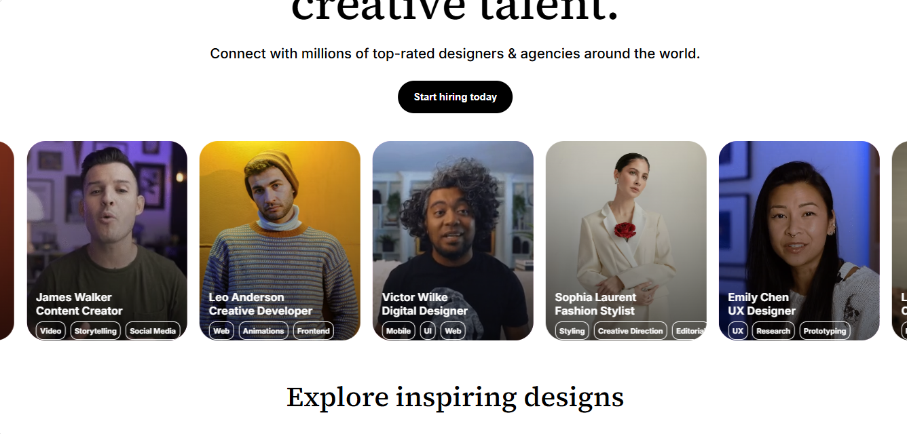
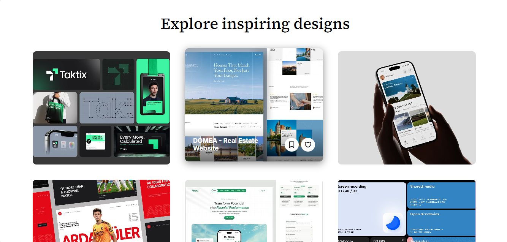
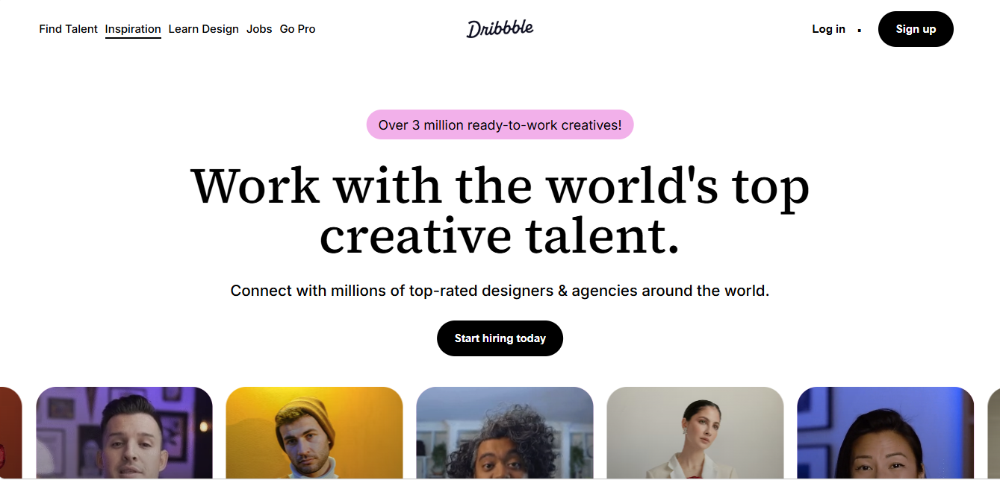

# Dribbble Clone

This is a modern Dribbble-inspired landing page built using HTML and CSS.
The project focuses on modern UI design, smooth animations, hover interactions, creative layouts, video integration, and portfolio-style sections.

## Features

* Modern desktop-first UI
* Smooth hover animations
* Infinite horizontal scrolling section
* Interactive video cards
* Portfolio-inspired layout
* Animated navigation hover effects
* Smooth transitions and shadows
* Clean typography and spacing
* Creative design showcase section
* Modern footer section

## Technologies Used

* HTML5
* CSS3
* Remix Icons
* Google Fonts
* Git & GitHub

## Folder Structure

```bash
dribbble-clone/
├── index.html
├── style.css
├── README.md
│
├── Images/
│   ├── desktop-preview.png
│   ├── explore-designs.png
│   └── hero-section.png
│
├── Videos/
│   └── demo-video.mp4
```

## Screenshots

### Hero Section



### Explore Designs Section



### Desktop View



## Demo Video

[Watch Demo Video](./Videos/demo-video.mp4)

## How to Run

1. Clone the repository:

```bash
git clone https://github.com/kenil948/dribbble-clone.git
```

2. Open `index.html` in your browser.

## Live Demo

Check it out here:
https://kenil948.github.io/dribbble-clone/

## What I Learned

* Modern UI Layout Structuring
* CSS Animations
* Hover Interactions
* Infinite Scrolling Effects
* Typography Hierarchy
* Video Integration
* Flexbox Layout
* GitHub Deployment Workflow
* Creating Portfolio-Style Interfaces
* Organizing Large Frontend Sections

## Future Improvements

* Fully responsive mobile layout
* Better infinite scroll optimization
* Advanced animations using JavaScript
* Dark mode support
* Interactive navigation menu

## Notes

This is a frontend practice project inspired by Dribbble and created for improving UI/UX and frontend development skills.
